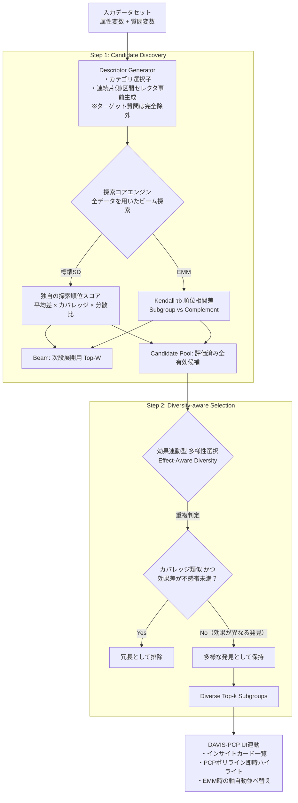

# 機能仕様書: 現代的サブグループ発見と例外モデルマイニング（Diverse Subgroup Discovery & EMM）

## 1. 概要・目的

本機能は、従来の1属性×1質問のペアワイズ検定（`feature/01_subgroup_auto_mining.md`）を刷新し、**複数属性の論理積（複合条件）** から、特異なデータ分布や多変量関係性の歪みを持つ部分集団を自律的に探索・提示するEDA（探索的データ解析）エンジンである。

### 初期実装における完成条件
**「意味の異なる複合セグメントが見つかり、その違いをPCP（平行座標プロット）で素早く確認できること」**

### 解決する課題
1. **複合セグメントの未探索**: 単一属性のクロス集計では見落とされる多次元空間の特異集団（例: `40<=年齢<60 ∧ 年収>=700万`）を高速発見する。
2. **冗長性の排除と例外の保持（Effect-Aware Diversity）**:
   単にデータ行が重複している（包含関係にある）からといって一律に捨てず、**効果の大きさや方向が異なる親子ルール（例: 親集団の中でも特に突出したコア層や例外層）は多様な発見として残す**ことで、一律排除による取りこぼしを減らす。
3. **PCP幾何学に直結する順位相関マイニング（Kendall $\tau_b$-EMM）**:
   5段階評価などのアンケート順序尺度において大量に発生する同順位（タイ）を正しく補正する **Kendall $\tau_b$** を採用し、**サブグループと補集合で順位関係が異なる質問ペアを発見し、PCP上でその違いを確認** できるようにする。
4. **超高速・インタラクティブなEDA操作性**:
   重いブートストラップや複雑な分割検証を初期探索から外し、全データを用いた単一のビーム探索（$< 1.0$秒）で直ちに結果を返し、PCPとのシームレスな対話を実現する。

---

## 2. アーキテクチャ構成

本エンジンは、**「記述子事前生成（Descriptor Generation）」** $\to$ **「ビーム探索（Candidate Discovery）」** $\to$ **「効果連動型・多様性選択（Effect-Aware Diversity Selection）」** の3ステップで構成する。



---

## 3. 入力データモデルと記述子生成

### 3.1 属性記述子の厳密な抽出とターゲット除外規則
* **属性変数プール ($A$)**:
  $$\text{role} == \text{"attribute"} \quad \land \quad \text{semanticType} \in \{\text{"categorical"}, \text{"ordinal"}, \text{"numeric"}\}$$
* **ターゲット変数の絶対除外規則**:
  - **標準SDモード**: 探索対象となっている質問変数 $Y$ そのものは、**いかなる場合も属性記述子プールから完全除外**する。
  - **EMMモード**: ターゲットペア $(X, Y)$ の両変数を記述子プールから完全除外する。
* **母集団の定義（接続契約）**:
  UI側でフィルタ（行選択・絞り込み）が適用されている場合は、そのフィルタ通過後の有効母集団の中でサブグループ $R$ と補集合 $\bar{R}$ を分割する。

### 3.2 連続属性の不等式・区間セレクタ事前生成（深さの確定）
探索途中で区間を合成すると深さの定義が破綻するため、**記述子生成時にあらかじめ区間条件を生成**する。

1. **生成するセレクタ種別**:
   各連続属性 $A_c$ の分位点（四分位の3カットポイント $Q_{25}, Q_{50}, Q_{75}$）から以下を生成:
   * **片側条件**: $A_c < t$、および $A_c \ge t$
   * **区間条件**: $t_i \le A_c < t_j$（例: $Q_{25} \le A_c < Q_{50}$, $Q_{50} \le A_c < Q_{75}$, $Q_{25} \le A_c < Q_{75}$）
   ※ 空集合になる条件や重複条件は事前に除去。
2. **探索深さ（Complexity）の定義**:
   ビーム探索では**異なる属性の条件を1ステップにつき1つ追加**する。したがって、**探索深さ $d$、条件数ペナルティ、および表示上の条件数（Complexity）は、使用している属性数と完全に一致**する（区間条件も1属性として深さ1で消費）。

---

## 4. 探索および評価アルゴリズム詳細

### 4.1 Beam と Candidate Pool の明確な分離、および枝刈り条件

探索の進行管理と最終出力の候補選定のため、2つの集合を明確に分離する。

| 集合 | 用途 | 管理方法 |
| :--- | :--- | :--- |
| **Beam** | 次の深さへ展開する上位 `beam_width` 件 | 各深さのステップごとに上位 $W$ 件で更新 |
| **Candidate Pool** | 最終的な多様性選択へ渡す評価済み候補のプール | 評価可能な候補を、同一ルールの重複を除き全件保存 |

#### 枝刈り（Pruning）と評価保留の明確な区別
1. **展開打ち切り（枝刈り）**:
   * サブグループの有効人数 $n_R < \text{min\_group\_size}$ の場合、これ以上条件を追加しても人数は増えないため、**その枝の展開を直ちに打ち切る**。
2. **採択保留（子孫探索は継続）**:
   * 補集合の有効人数 $n_{\bar{R}} < \text{min\_group\_size}$ の場合、または補集合側の $\tau_b$ が未定義（分散ゼロ）の場合、当候補自体の採択は見送るが、**条件追加によりサブグループが縮小すれば補集合人数が増えて計算可能になる可能性があるため、子孫の探索（枝の展開）は打ち切らない**。

---

### 4.2 単変量評価スコアの確定仕様（標準SDモード）

本スコアは、**標準化平均差に、両群のサンプル規模とサブグループ内のばらつきを加味した、独自の探索順位スコア**である（統計的有意性や信頼度を表す値ではない）。

#### (1) 数値ターゲット（Numeric Target）の評価式
※ 5段階評価などのアンケート変数を本モードで扱う場合は、「1〜5を等間隔の得点として扱う」ものとする。

生スコア $S_{\text{raw}}(R)$ および上限 $S_{\max}$（既定値: `50.0`）による確定式:

$$S_{\text{raw}}(R) = \sqrt{\frac{n_R \cdot n_{\bar{R}}}{N}} \frac{|\bar{y}_R - \bar{y}_{\bar{R}}|}{s_{\text{pooled}}} (1 + B(R))$$
$$\text{Score}_{\text{numeric}}(R) = \min(S_{\text{raw}}(R), \; S_{\max}) - \lambda |R|$$

* $n_R, n_{\bar{R}}$: サブグループおよび補集合で、**実際にターゲット変数が観測された有効行数**（欠損は分母から除外、$N = n_R + n_{\bar{R}}$）。双方が $\text{min\_group\_size}$ 以上であることを要する。
* $\bar{y}_R, \bar{y}_{\bar{R}}$: サブグループおよび補集合の平均値
* $s_{\text{pooled}}$: プールされた標準偏差 $\sqrt{\frac{(n_R-1)s_R^2 + (n_{\bar{R}}-1)s_{\bar{R}}^2}{N-2}}$
* $\lambda |R|$: 条件数（属性数）ペナルティ（既定値: $\lambda = 0.05$）
* $B(R)$: サブグループのばらつきが小さい場合に付与される分散縮小ボーナス（条件数ペナルティ前のスコアを最大1.5倍にする）。

**分散縮小ボーナス $B(R)$ の定義とゼロ分散時の明示的分岐**:
両群の標準偏差 $s_R, s_{\bar{R}}$ に応じて以下のように定義する:

| 状態 | ボーナス $B(R)$ / スコアの扱い | 備考 |
| :--- | :--- | :--- |
| $s_R > 0, \; s_{\bar{R}} > 0$ | $B(R) = \min\left(0.5, \; \max\left(0, \ln\frac{s_{\bar{R}}}{s_R}\right)\right)$ | 通常ケース（最大 $+0.5$） |
| $s_R = 0, \; s_{\bar{R}} > 0$ | $B(R) = 0.5$（上限） | 「全員が同一回答（最高評価等）」のケース |
| $s_R > 0, \; s_{\bar{R}} = 0$ | $B(R) = 0$ | サブグループ側のみばらつきがあるケース |
| $s_R = 0, \; s_{\bar{R}} = 0$ かつ $\bar{y}_R = \bar{y}_{\bar{R}}$ | **除外** | ターゲット全体が定数のため探索対象外 |
| $s_R = 0, \; s_{\bar{R}} = 0$ かつ $\bar{y}_R \neq \bar{y}_{\bar{R}}$ | **完全分離（特殊扱い）** | $S_{\text{raw}} = S_{\max}$ とし、`complete_separation: true` を付与 |

#### (2) 名義ターゲット（Binary Target Selector）の評価式
特定カテゴリ（例: `target_binary_category = "満足"`）の回答割合の高低を比較:
$$\text{Score}_{\text{binary}}(R) = \min\left(\sqrt{\frac{n_R \cdot n_{\bar{R}}}{N}} \cdot |p_R - p_{\bar{R}}|, \; S_{\max}\right) - \lambda \cdot |R|$$
※ 欠損回答は「非該当」として0に変換せず、割合計算の分母から除外する。

---

### 4.3 EMM（Exceptional Model Mining）モード：Kendall $\tau_b$ 相関特異性

アンケートの5段階評価など、同順位（タイ）が頻発する順序尺度に対応するため、同順位補正を含む **Kendall $\tau_b$** を使用する。

#### (1) Kendall $\tau_b$ の定義と同順位補正
$$\tau_b = \frac{P - Q}{\sqrt{(P + Q + T_X)(P + Q + T_Y)}}$$
* $P$: concordant pairs（順方向ペア）
* $Q$: discordant pairs（逆方向交差ペア）
* $T_X, T_Y$: $X$側のみ、または$Y$側のみで同順位となっているタイペア数

#### (2) 未定義チェックと有効性確認
* サブグループ・補集合の**双方**で、$X$ と $Y$ がともに観測された行数を確認し、双方が $\text{min\_group\_size}$ を満たすことを確認する。
* **どちらか一方でも** $X$ または $Y$ の値がすべて同一（分散ゼロ）となり $\tau_b$ が未定義となる候補は、評価対象から除外する。

#### (3) EMM評価スコア（補集合との相関差）
$$\text{Score}_{\text{EMM}}(R) = \min\left(\sqrt{\frac{n_R \cdot n_{\bar{R}}}{N}} \cdot |\tau_{b, R} - \tau_{b, \bar{R}}|, \; S_{\max}\right) - \lambda \cdot |R|$$

#### (4) 符号反転（Sign Reversal）の独立属性化
メタデータとして `reversal: true`（例: $\tau_{b, \bar{R}} > 0.2$ かつ $\tau_{b, R} < -0.2$）および `delta_tau = \tau_{b, R} - \tau_{b, \bar{R}}$` を独立保持する。UI側で「順位相関が逆方向の候補を優先」ソートを行えるようにする。

---

### 4.4 効果連動型・多様性選択（Effect-Aware Diversity Selection）

Candidate Pool から最終 Top-$k$ を選出する際、**通常の探索で得られた候補について、親子間の効果差を考慮し、一律の重複排除を避ける**（親集団内の例外を専用の基準で探索するものではない）。

#### 重複判定アルゴリズム:
上位確定候補 $R_{\text{selected}}$ と、新規候補 $R_{\text{cand}}$ について:
1. **カバレッジ重複判定**:
   $$\text{Jaccard}(C_1, C_2) \ge 0.5 \quad \lor \quad \text{Overlap}(C_1, C_2) \ge 0.8$$
   を満たすか判定。
2. **効果の差分チェック（不感帯付き）**:
   カバレッジが類似している場合でも、以下の**いずれか**を満たす場合は「異なる発見（例外）」として**両方残す**:
   * **効果方向の逆転**: 両候補がともに最小差（`min_effect_diff`）以上の乖離を持ち、かつその方向が逆である場合（微小差の符号違いは不感帯で除外）。
   * **十分な効果差**: 親集団や先行候補との効果差が `min_effect_diff` 以上である場合。
3. **モード別の効果比較量と既定値**:
   ※ 以下の閾値は統計的有意性ではなく、EDAの類似判定用調整値である。

| モード | 比較する効果量 | 最小差の目安（`min_effect_diff`） |
| :--- | :--- | :--- |
| **数値** | 平均差 $\bar{y}_R - \bar{y}_{\bar{R}}$ | $0.3 \cdot s_{\text{all}}$（全体標準偏差単位） |
| **二値** | 割合差 $p_R - p_{\bar{R}}$ | $0.10$（10%pt） |
| **EMM** | 相関差 $\tau_{b, R} - \tau_{b, \bar{R}}$ | $0.35$（Kendall $\tau_b$ 差） |

4. **親子関係の構造化出力**:
   子ルールが親ルールと同時に残った場合、UIが機械的に取得できるよう、レスポンスに `parent_insight_id` および `parent_delta_mean` などを付与する。

---

## 5. API仕様

### エンドポイント
`POST /api/mining/modern-subgroup`

### リクエストボディ
```json
{
  "mode": "standard", // "standard" | "emm_kendall"
  "target_questions": ["q12_satisfaction"], // standardは1変数、EMMは2変数
  "target_binary_category": null, // 二値モード時に対象とするカテゴリ値（文字列または数値）
  "max_depth": 2, // 1 または 2（初期版は最大2）
  "beam_width": 30,
  "min_group_size": 30,
  "top_k": 10,
  "redundancy": {
    "jaccard_threshold": 0.5,
    "overlap_threshold": 0.8,
    "min_effect_diff": 0.3 // 数値: 0.3(SD単位), 二値: 0.10(割合), EMM: 0.35(tau差)
  }
}
```

### レスポンスボディ（同一仮想データ N=1000 からの厳密な再計算値）
※ 全体データ: $N=1000, \bar{y}_{\text{all}} = 3.20, s_{\text{all}} = 1.10$

```json
{
  "run_id": "e8a21f4c-...",
  "mode": "standard",
  "summary": {
    "total_candidates_explored": 380,
    "non_redundant_insights_count": 2
  },
  "insights": [
    {
      "id": "msd_001",
      "rule": {
        "conditions": [
          { "column": "age", "operator": "between", "value": [40, 60], "label": "40 <= 年齢 < 60" }
        ],
        "complexity": 1,
        "text": "年齢が「40〜59歳」"
      },
      "coverage": {
        "n": 200,
        "ratio": 0.200,
        "row_ids": ["1", "5", "12", "..."]
      },
      "target_stats": {
        "subgroup_mean": 3.95,
        "complement_mean": 3.01,
        "overall_mean": 3.20,
        "delta_mean": 0.94,
        "subgroup_sd": 0.80,
        "complement_sd": 1.09,
        "sd_ratio": 0.734,
        "variance_ratio": 0.540
      },
      "ranking_reason": {
        "primary_driver": "mean_elevation_and_low_variance",
        "description": "他群平均より+0.94高く、標準偏差0.80（補集合1.09）とばらつきが小さいため上位にランクイン"
      },
      "score": 14.95,
      "complete_separation": false,
      "parent_insight_id": null,
      "parent_delta_mean": null,
      "emm_stats": null,
      "narrative": "「40〜59歳」の層（200名, 20.0%）は、補集合に比べ満足度が平均+0.94高く、回答がまとまっています。"
    },
    {
      "id": "msd_002",
      "rule": {
        "conditions": [
          { "column": "age", "operator": "between", "value": [40, 60], "label": "40 <= 年齢 < 60" },
          { "column": "annual_income", "operator": ">=", "value": 7000000, "label": "年収 >= 700万" }
        ],
        "complexity": 2,
        "text": "年齢が「40〜59歳」かつ 年収が「700万円以上」"
      },
      "coverage": {
        "n": 50,
        "ratio": 0.050,
        "row_ids": ["5", "12", "..."]
      },
      "target_stats": {
        "subgroup_mean": 4.40,
        "complement_mean": 3.14,
        "overall_mean": 3.20,
        "delta_mean": 1.26,
        "subgroup_sd": 0.60,
        "complement_sd": 1.08,
        "sd_ratio": 0.556,
        "variance_ratio": 0.306
      },
      "ranking_reason": {
        "primary_driver": "prominent_subgroup",
        "description": "親集団（#1: 3.95）の中でもさらに平均が+0.45高い突出セグメント"
      },
      "score": 12.16,
      "complete_separation": false,
      "parent_insight_id": "msd_001",
      "parent_delta_mean": 0.45,
      "emm_stats": null,
      "narrative": "「40〜59歳・年収700万円以上」の層（50名, 5.0%）は、高評価の親集団（平均3.95）の中でさらに平均4.40と突出して高いセグメントです。"
    }
  ]
}
```

---

## 6. GUI設計構想

### 6.1 全体画面レイアウト（Miningタブ）

```
+--------------------------------------------------------------------------------------------------+
| [分析モード] (•) 複合条件マイニング (標準SD)   ( ) 順位相関特異性 (Kendall-EMM)  ( ) 単変量総当たり  |
| [設定]   最大条件数: [ 2 ▼ ]  最小集団サイズ: [ 30名 ▼ ]  表示件数: [ 10件 ▼ ] [ ⚡ マイニング実行 ] |
+--------------------------------------------------------------------------------------------------+
|  発見された多様なインサイト (2件)                            |  連動ビュー (PCP / 散布図)          |
|  [ソート: スコア順 ▼]  [フィルタ: 全て | 高評価群 | 低評価群]      |                                    |
|                                                             |  +------------------------------+  |
|  +-------------------------------------------------------+  |  |   Parallel Coordinates Plot  |  |
|  | ★ #1 40<=年齢<60                             [PCP表示] |  |  |                              |  |
|  |    満足度: 3.95 (他群平均 3.01 / 差 +0.94) [平均高]    |  |  |    (選択されたサブグループの   |  |
|  |    特徴: 高評価かつばらつき小 (SD 0.80 / 他群 1.09)     |  |  |     ポリラインが太線シアンで   |  |
|  |    対象: 200名 (20.0%) | スコア: 14.95                  |  |  |     強調表示される)            |  |
|  |    [条件タグ: 40<=年齢<60]                              |  |  |                              |  |
|  +-------------------------------------------------------+  |  |   [軸の自動並べ替え: 適用中]  |  |
|  | #2 40<=年齢<60 ∧ 年収>=700万                [PCP表示] |  |  +------------------------------+  |
|  |    満足度: 4.40 (親集団 3.95 / 差 +0.45) [突出層]      |  |  選択中セグメント: 200件 (20.0%)   |  |
|  |    特徴: 親集団(#1)の中でも特に高評価なコアセグメント   |  |  [フォーカスモード起動]         |  |
|  |    [親ルール: #1]                                     |  |  [この条件でフィルタ保持]       |  |
|  +-------------------------------------------------------+  |  |                              |  |
+--------------------------------------------------------------------------------------------------+
```

### 6.2 インサイトカードとPCP連動UX

1. **「なぜ上位なのか」が伝わるカード表示**:
   * 「平均が高い」「平均が低い」「平均差大・ばらつき小」「突出層」「順位相関が逆方向」など、評価式に基づいた実直な理由バッジを表示。
2. **親子ルールの構造化バッジ**:
   * 親ルールと同時に選ばれたサブグループ（例: #2）には、`[親ルール: #1]` バッジを明示し、親からの差分をひと目で確認可能。
3. **PCP（平行座標プロット）との即時連動**:
   * `[PCP表示]` をクリックすると、該当行IDが即座に Redux ストア経由でハイライトされ、PCPのポリラインがシアン色で浮かび上がる。
   * Kendall-EMM モードでは、順位相関の差が大きい2軸が自動的に隣接配置され、順位関係の違いをPCP上で素早く確認できる。

---

## 7. 性能目標と計算量最適化

1. **全データを用いたビーム探索による即時応答**:
   ブートストラップ等の多重反復を初期版から除外したことにより、データ数 $N=5,000$, 属性数 $P=30$ の場合でも **0.4〜0.8秒以内** に全探索が完了。
2. **ビットセット演算（Bitmask Vectorization）**:
   各属性セレクタの該当行をビット配列で保持し、AND結合および Jaccard / Overlap 判定をビット演算で超高速処理。

---

## 8. 初期実装スコープと将来拡張

| 項目 | 初期実装 (Phase 1) | 将来拡張 (Phase 2以降) |
| :--- | :--- | :--- |
| **探索対象** | 複合条件 (深さ1〜2) + Kendall $\tau_b$ EMM | 深さ3への拡張、多変量回帰EMM |
| **記述子生成** | 片側不等式 + 区間条件を事前生成 | 動的カットポイント探索 |
| **重複排除** | 効果連動型（Jaccard 0.5 + Overlap 0.8 + 最小差以上の逆転・効果差） | DASSD適応閾値、EDSLM決定リスト |
| **検証基盤** | 全データ探索（EDA特化、p/q値なし） | Honest Holdout (70/30)、Permutation検定 |
| **安定性評価** | なし（高速性優先） | オンデマンド実行のBootstrap Stability |
