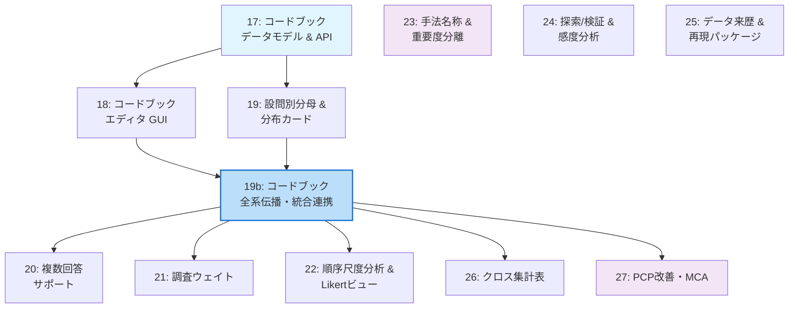

# 監査指摘統合ロードマップ

文書ID: DAVIS-FEAT-016  
版: 2.1.0  
作成日: 2026-09-07  
種別: ロードマップ（個別仕様書への索引）

---

## 1. 本文書の位置づけ

4件の独立した監査レポートから**不具合レベル（修正済み）を除外**した機能不足・統計知見・GUI改善項目を、
**エージェントが1セッションで一貫して実装可能な粒度**で12本の個別仕様書（17〜27, 19b）に分割した。

### 根拠文書

| 監査ID | ファイル |
|--------|---------|
| Audit-1 | [DAVIS_PCP_Audit_2026-09-07.md](file:///c:/dev/davis-pcp/feature/audit-log/DAVIS_PCP_Audit_2026-09-07.md) |
| Audit-2 | [davis_e2e_review_2026-09-07.md](file:///c:/dev/davis-pcp/feature/audit-log/davis_e2e_review_2026-09-07.md) |
| Audit-3 | [davis_pcp_audit_20260907.md](file:///c:/dev/davis-pcp/feature/audit-log/davis_pcp_audit_20260907.md) |
| Audit-4 | [gemini-audit.txt](file:///c:/dev/davis-pcp/feature/audit-log/gemini-audit.txt) |

---

## 2. 分割方針

### 2.1 分割の基準

1. **依存方向が一方向**: 後段の仕様は前段の成果物のみに依存する
2. **変更対象の局所性**: 1仕様が触るファイル群が重複しない（または最小限）
3. **テスト可能性**: 各仕様の完了後、単体で回帰テストを実行して合否を判定できる
4. **セッション完結性**: 1セッション（エージェント1回の連続実装）で着手〜テスト通過まで到達できる量

### 2.2 依存関係グラフ

---

## 3. 実装順序と仕様書一覧

### フェーズ1: 共通基盤（最重要・順序依存あり）

| 順 | 文書 | 要件ID | 概要 | 前提 |
|----|------|--------|------|------|
| 1 | [17_codebook_data_model.md](file:///c:/dev/davis-pcp/feature/17_codebook_data_model.md) | F01-BE | コードブックのスキーマ定義・ストレージ・API・CSV辞書インポート | なし |
| 2 | [18_codebook_editor_gui.md](file:///c:/dev/davis-pcp/feature/18_codebook_editor_gui.md) | F01-FE | コードブックエディタGUI（質問文一括貼付・選択肢一括パース・グリッドビュー） | 17完了 |
| 3 | [19_question_denominators.md](file:///c:/dev/davis-pcp/feature/19_question_denominators.md) | F02 | 設問別分母の集計ロジック・分布カードの再設計（4分母・Top2/Bottom2） | 17完了 |
| **4** | [19b_codebook_system_integration.md](file:///c:/dev/davis-pcp/feature/19b_codebook_system_integration.md) | **F01-INT** | **コードブック全系伝播・統合連携アーキテクチャ（順序・ラベル・尺度・役割の全画面＆全アルゴリズム網羅的連動）** | **17, 18, 19完了** |

### フェーズ2: アンケート特有機能（19b完了が前提、相互独立）

| 順 | 文書 | 要件ID | 概要 | 前提 |
|----|------|--------|------|------|
| 5 | [20_multiple_answer_support.md](file:///c:/dev/davis-pcp/feature/20_multiple_answer_support.md) | F03 | 複数回答グループ定義・集計・表示（回答者ベース%と延べ回答ベース%） | 19b完了 |
| 6 | [21_survey_weight.md](file:///c:/dev/davis-pcp/feature/21_survey_weight.md) | F04 | 調査ウェイト列の指定・加重集計・非加重nとの併記表示 | 19b完了 |
| 7 | [22_ordinal_analysis_and_likert.md](file:///c:/dev/davis-pcp/feature/22_ordinal_analysis_and_likert.md) | F06 | 順序尺度の分析経路選択（Mann-Whitney/Kendall τb）・Diverging Stacked Bar Chart | 19b完了 |

### フェーズ3: 分析品質（独立して着手可能）

| 順 | 文書 | 要件ID | 概要 | 前提 |
|----|------|--------|------|------|
| 8 | [23_method_naming_and_importance.md](file:///c:/dev/davis-pcp/feature/23_method_naming_and_importance.md) | F09, F10 | 手法名称の正確化（実験的補完・補正V等）・特徴重要度（MDI/Permutation）の分離表示 | なし |
| 9 | [24_exploration_verification_sensitivity.md](file:///c:/dev/davis-pcp/feature/24_exploration_verification_sensitivity.md) | F07, F08 | 探索/検証モード分離（p値非表示・Holdout検証）・外れ値品質の感度分析 | なし |
| 10 | [25_data_provenance.md](file:///c:/dev/davis-pcp/feature/25_data_provenance.md) | F05 | データ来歴・補完マスク・API共通コンテキスト・再現パッケージ | なし |

### フェーズ4: 可視化拡張

| 順 | 文書 | 要件ID | 概要 | 前提 |
|----|------|--------|------|------|
| 11 | [26_crosstab_view.md](file:///c:/dev/davis-pcp/feature/26_crosstab_view.md) | F12 | 2変量クロス集計表・調整済み標準化残差（ASR）有意セルハイライト | 19b推奨 |
| 12 | [27_pcp_mca_ui.md](file:///c:/dev/davis-pcp/feature/27_pcp_mca_ui.md) | F11, F13, F14 | PCPジッター/リボン表示・MCA（多重対応分析）・高DPI座標補正・UI安定化 | なし |

### 監査指摘との対応表

| 統合ID | 仕様書 | Audit-1 | Audit-2 | Audit-3 | Audit-4 |
|--------|--------|---------|---------|---------|---------|
| F01 | 17, 18 | §3.1 | §4.1 | §4.1 | §2.5 |
| **F01-INT** | **19b** | **§2 (A05, A06, A12)** | **§2 (B04, B05)** | **§3 (D06, D08)** | **—** |
| F02 | 19 | §3.2 | §4.2 | §4.2 | — |
| F03 | 20 | §3.2 | §4.2 | §4.3 | §2.4 |
| F04 | 21 | §3.3 | §4.3 | §4.4 | §2.1 |
| F05 | 25 | §3.4 | §4.4,§4.5 | §4.5 | — |
| F06 | 22 | §4.2 | — | §5.1 | §2.2,§3.2 |
| F07 | 24 | §4.3 | §5.2 | §5.4 | — |
| F08 | 24 | §4.1 | — | §5.5 | — |
| F09 | 23 | §4.5 | §5.3 | §5.3 | — |
| F10 | 23 | §4.4 | §5.4 | §5.6 | — |
| F11 | 27 | — | — | — | §3.1,§3.5 |
| F12 | 26 | — | — | §4.2 | §2.3 |
| F13 | 27 | — | — | — | §3.3 |
| F14 | 27 | — | — | — | §1.1-§1.3 |

---

## 4. 完了判定

すべての仕様書を実装した後、以下のE2Eフローが通ることを最終受入条件とする：

1. CSV取込 → コードブック設定 → PCP表示で値ラベル・カテゴリ順が反映（19b検証）
2. 補完実行 → コードブック定義・列IDが消失せずPCP描画が維持（19b検証）
3. PCPブラッシング → 分布カード → 分母がビュー間で一致
4. Likertビュー → PCPクロス → 順序尺度として検定選択
5. MA設問定義 → 集計 → エクスポートで回答者ベース%が正しい
6. ウェイト指定 → 加重/非加重の両値が併記
7. 補完 → 来歴確認 → Undo → 原データ復帰
8. 探索 → 検証モード遷移 → 候補ルールと基準集合が引き継がれる
9. セッション保存 → リロード → コードブック・リビジョン・scopeが復元
